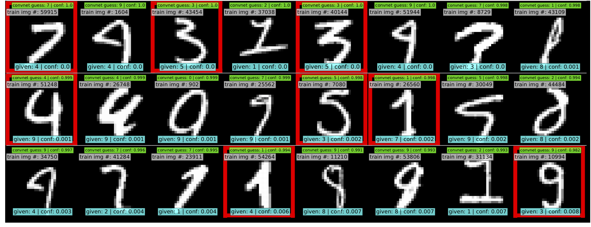
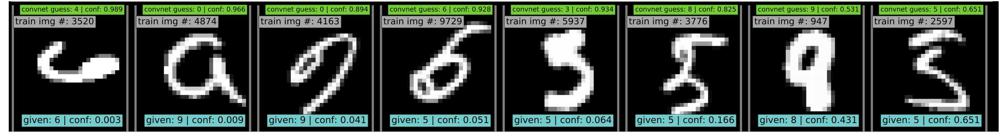

# ```confidentlearning```
A Python package for Confident Learning with state-of-the-art algorithms for multiclass learning with noisy labels, detection of label errors in massive datasets, latent noisy channel estimation, latent prior estimation, and much more.

## Note to the reviewers of our NIPS 2018 manuscript
Please view the [supplementary materials of our NIPS2018 submission by clicking here](https://www.dropbox.com/s/n8hydz9zj6skqwg/nips2018_confident_learning_supplements.pdf?dl=0). The password is the first word of the title of our submission, all lowercased. A system error prevented inclusion at submit-time. 

## Installation

Python 2.7 and Python 3.5 are supported.

To use the **confidentlearning** package just run:

```
$ pip install git+https://github.com/cgnorthcutt/confidentlearning.git
```

If you have issues, you can also clone the repo and install by typing:

```
$ conda update pip # if you use conda
$ git clone https://github.com/cgnorthcutt/confidentlearning.git
$ cd confidentlearning
$ pip install -e .
```

## Get started with easy, quick examples.

New to **confidentlearing**? Start with:

1. [Visualizing confident learning](examples/visualizing_confident_learning.ipynb)
2. [A simple example of learning with noisy labels on the multiclass Iris dataset](examples/iris_simple_example.ipynb). 

These examples show how easy it is to characterize label noise in datasets, learn with noisy labels, identify label errors, estimate latent priors and noisy channels, and more.

## We identify ~50 label errors in MNIST with confident learning. Learn more [here](finding_MNIST_label_errors).

Label errors of the original MNIST train dataset identified algorithmically using the rankpruning algorithm. Depicts the 24 least confident labels, ordered left-right, top-down by increasing self-confidence (probability of belonging to the given label), denoted conf in teal. The label with the largest predicted probability is in green. Overt errors are in red.


 Selected label errors in the MNIST test dataset ordered by increasing self-confidence (in teal).

## We identify ~5000 validation set label errors in ImageNet. Learn more [here](finding_ImageNet_label_errors).

Label errors in the 2012 ImageNet validation dataset identified automatically with confident learning using a pre-trained resnet18. Displayed are the 96 least confident labels. We see that ImageNet contains numerous multi-label images.


## The first practical, general algorithm for multiclass learning with noisy labels
### **confidentlearning** algorithms are fast, robust, and work with any probablistic classifier - see [examples](examples)
Multiclass learning with noisy labels in just three lines of code:

```python
from confidentlearning.classification import RankPruning
from sklearn.linear_model import LogisticRegression as logreg

rp = RankPruning(clf=logreg()) # Pass in any classifier. Yup, neural networks work, too.
rp.fit(X_train, y_may_have_label_errors)
pred = rp.predict(X_test) # Estimates the predictions you would have gotten had you trained without label errors.
``` 

## The Polyplex 
### The key to learning in the presence of label errors is estimating the joint distribution between the actual, hidden labels '*y*' and the observed, noisy labels '*s*'. Using **confidentlearning**, we can completely characterize the trace of the latent joint distribution, *trace(P<sub>s,y</sub>)*, given *p(y)*, for any fraction of label errors, i.e. for any trace of the noisy channel, *trace(P<sub>s|y</sub>)*.
You can check out how to do this yourself here:
1. [Drawing Polyplices](examples/drawing_polyplices.ipynb)
2. [Computing Polyplices](confidentlearning/polyplex.ipynb)
